# 📊 Mermaid Diagrams & Flowcharts

## 🎯 User Journey Flowcharts

### Main User Journey
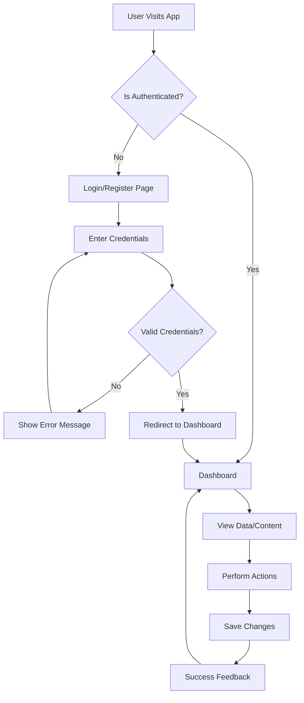

### Authentication Flow
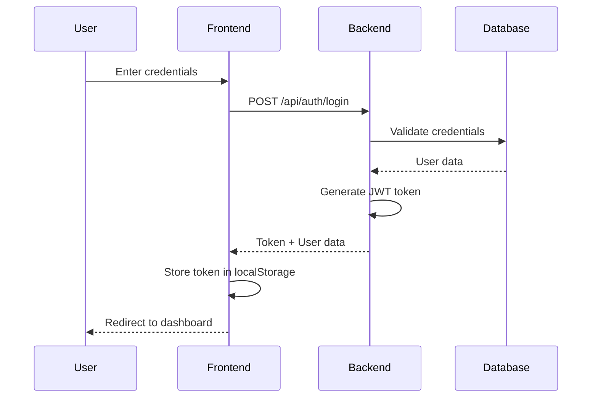

### Data Flow Architecture
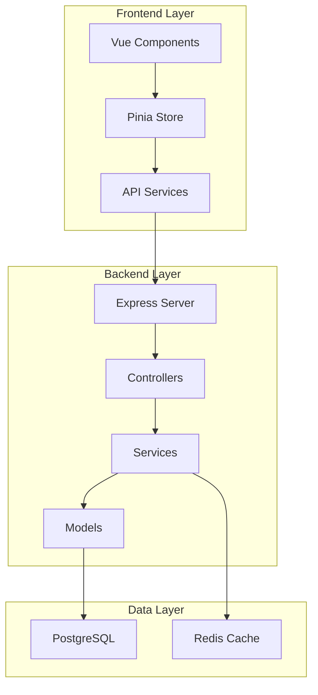

## 🏗️ System Architecture Diagrams

### High-Level System Architecture
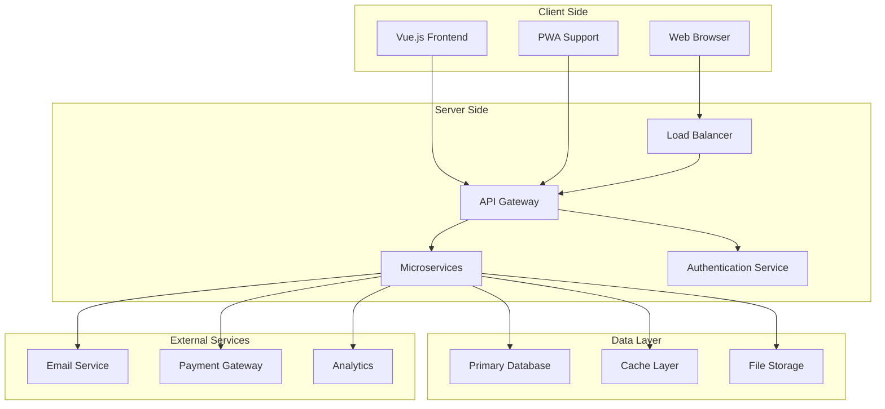

### Database Schema
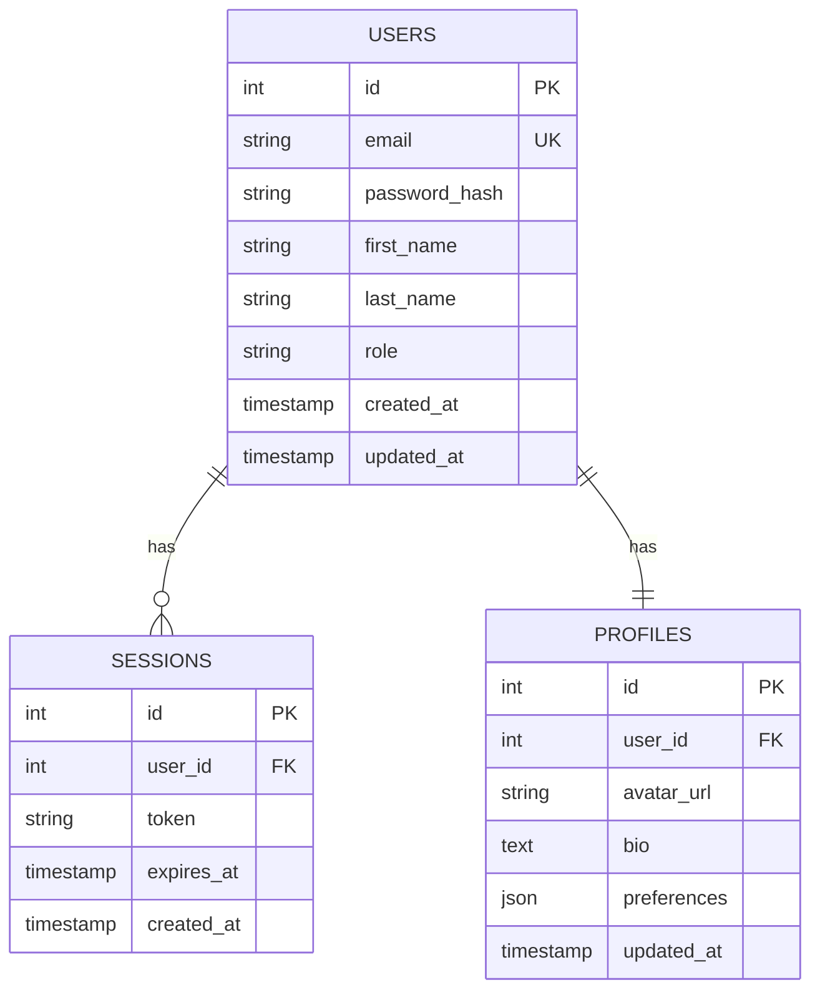

## 🔄 Process Flow Diagrams

### User Registration Process
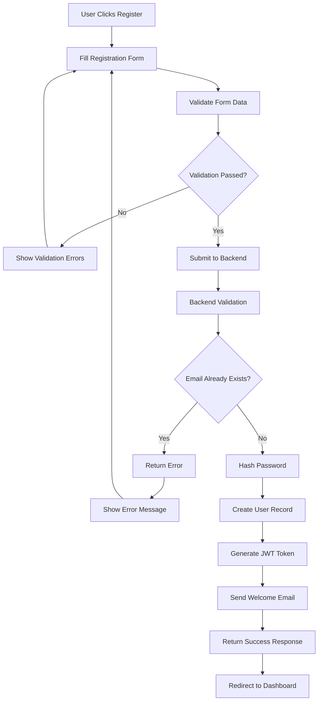

### Data Processing Workflow
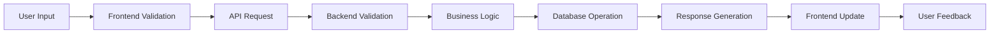

## 🎨 UI Component Hierarchy

### Component Tree Structure
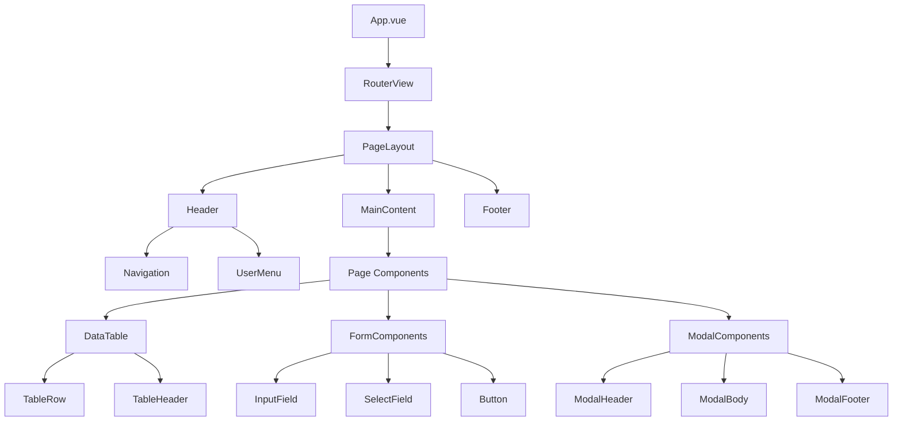

## 🔐 Security Flow

### Authentication & Authorization Flow
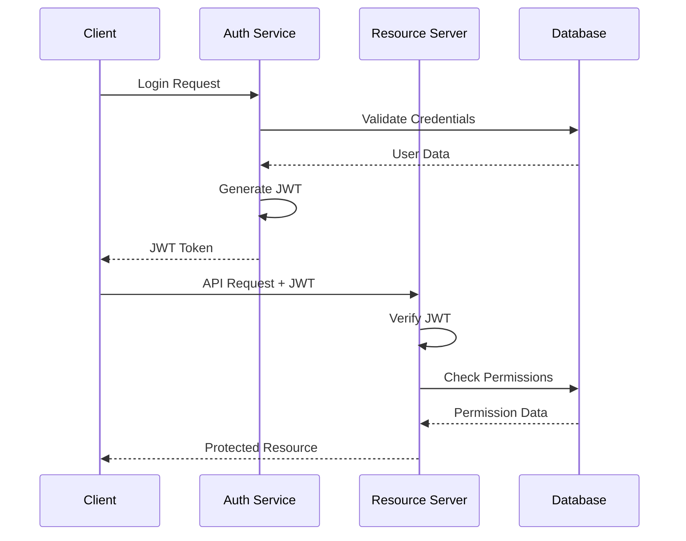

## 📊 State Management Flow

### Pinia Store Architecture
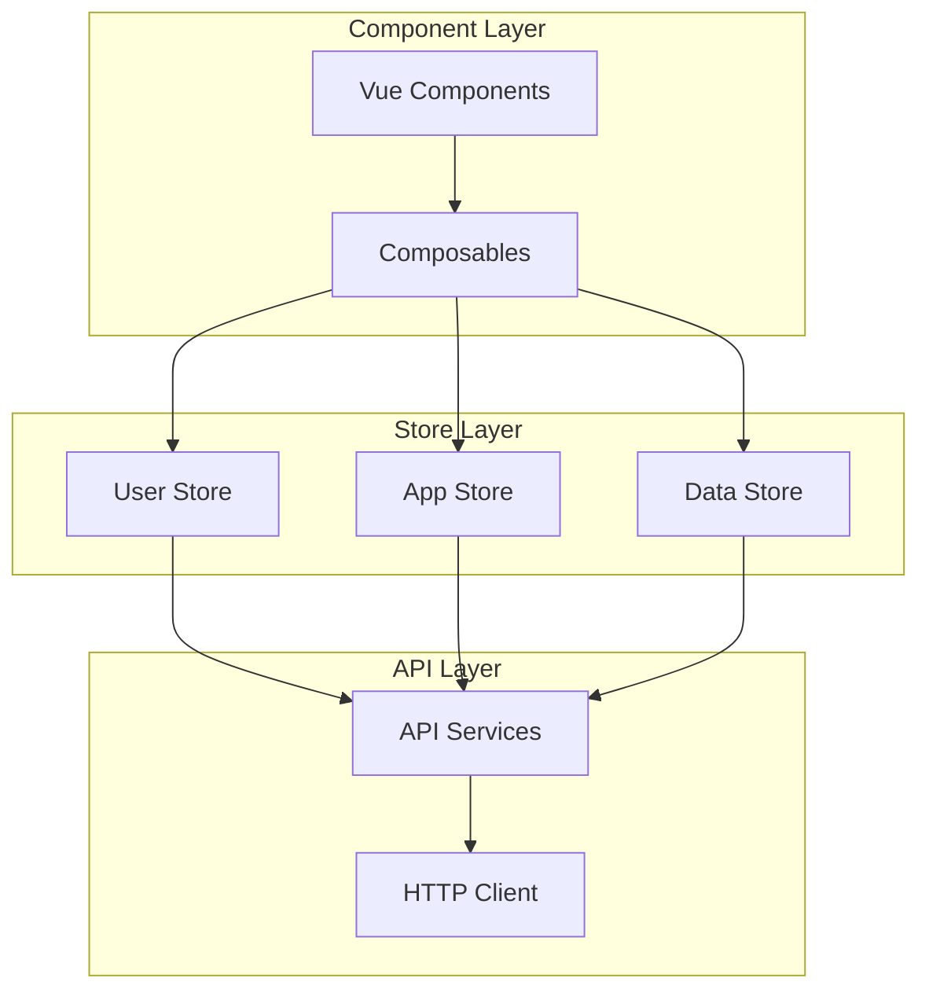

## 🚀 Deployment Pipeline

### CI/CD Pipeline Flow
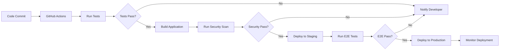

## 📱 Responsive Design Breakpoints

### Device Breakpoint Flow
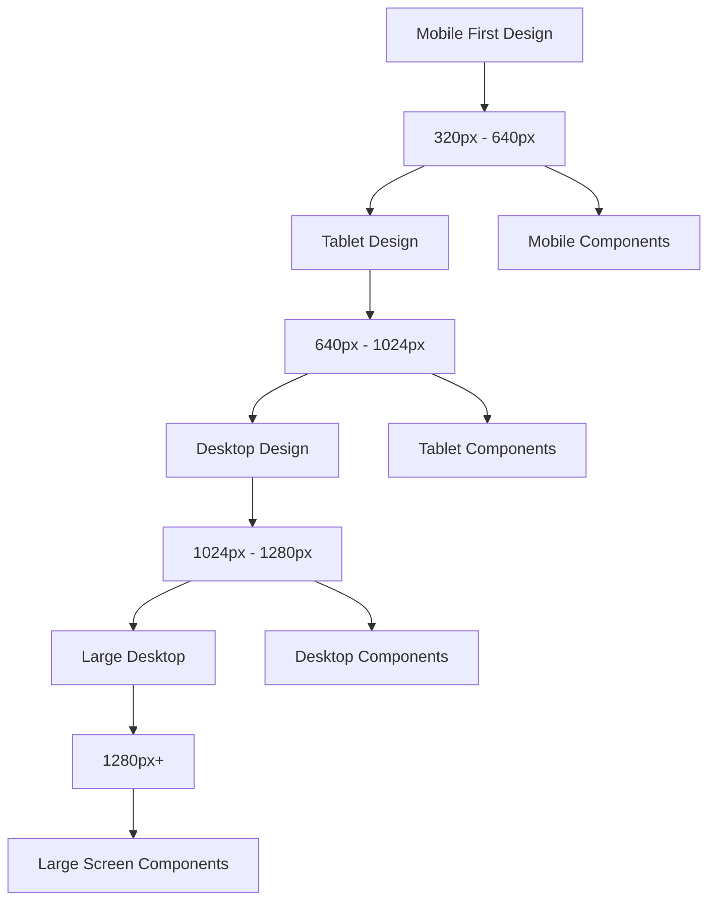

## 🔄 Error Handling Flow

### Error Management Process
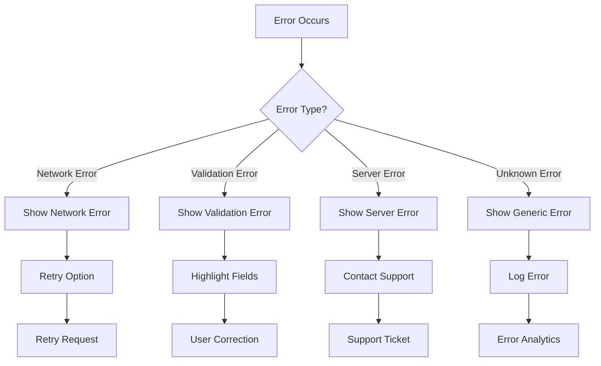

## 📈 Performance Monitoring

### Performance Metrics Flow
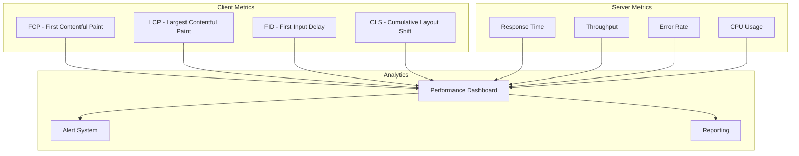

## 🎯 User Story Mapping

### Epic to Story Breakdown
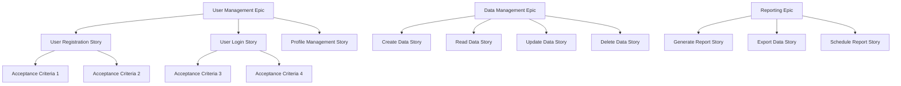

---

## 📝 Diagram Usage Guidelines

### How to Use These Diagrams

1. **User Journey Diagrams**: Use for understanding user flows and identifying pain points
2. **System Architecture**: Reference for technical implementation and system design
3. **Process Flows**: Guide for implementing business logic and workflows
4. **Component Hierarchy**: Structure for organizing Vue.js components
5. **Security Flows**: Implementation guide for authentication and authorization
6. **State Management**: Architecture for Pinia store organization
7. **Deployment Pipeline**: CI/CD process implementation
8. **Error Handling**: Comprehensive error management strategy

### Customizing Diagrams

To customize these diagrams for your specific project:

1. Replace placeholder text with your actual data
2. Update colors and styling to match your brand
3. Modify flow logic based on your business requirements
4. Add or remove steps based on your specific needs
5. Update component names to match your implementation

### Tools for Editing

- **Mermaid Live Editor**: https://mermaid.live/
- **VS Code Extension**: Mermaid Preview
- **Online Tools**: Draw.io, Lucidchart
- **Documentation**: Include in your project documentation

---

**Document Control:**
- **Created:** [Date]
- **Last Updated:** [Date]
- **Version:** 1.0.0
- **Next Review:** [Date]
